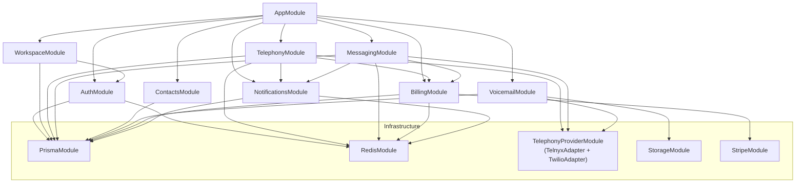

# Phone2Client (P2C) — System Architecture Document

> **Version**: 1.0.0-draft  
> **Status**: Awaiting Stakeholder Approval  
> **Last Updated**: 2026-07-08  
> **Author**: Principal Architect  
> **Companion**: [PRD](file:///d:/AI/Phone2Client%20-%20P2C/docs/01-PRD.md)

---

## 1. Architecture Overview

P2C follows a **Clean Architecture** pattern with clear separation between domain logic, application services, infrastructure, and presentation. The system is designed as a **modular monolith** for MVP, with explicit module boundaries that enable future decomposition into microservices.

### 1.1 High-Level System Diagram

```
┌─────────────────────────────────────────────────────────────────────────────┐
│                              CLIENTS                                        │
│  ┌──────────────┐  ┌──────────────┐  ┌──────────────┐  ┌───────────────┐   │
│  │  React SPA   │  │  Mobile App  │  │   API Keys   │  │  Webhooks In  │   │
│  │  (TypeScript) │  │  (Future)    │  │  (External)  │  │  (Telnyx/     │   │
│  └──────┬───────┘  └──────┬───────┘  └──────┬───────┘  │   Twilio)     │   │
│                                               │          └───────┬───────┘   │
└─────────┼──────────────────┼──────────────────┼──────────────────┼──────────┘
          │                  │                  │                  │
          ▼                  ▼                  ▼                  ▼
┌─────────────────────────────────────────────────────────────────────────────┐
│                           EDGE / GATEWAY                                    │
│  ┌──────────────────────────────────────────────────────────────────────┐   │
│  │  Nginx / Caddy (Reverse Proxy, TLS Termination, Rate Limiting)      │   │
│  └──────────────────────────────┬───────────────────────────────────────┘   │
└─────────────────────────────────┼──────────────────────────────────────────┘
                                  │
                                  ▼
┌─────────────────────────────────────────────────────────────────────────────┐
│                        APPLICATION SERVER                                   │
│  ┌─────────────┐  ┌─────────────┐  ┌─────────────┐  ┌─────────────────┐   │
│  │   REST API   │  │  WebSocket  │  │  Webhook     │  │  Background     │   │
│  │   Server     │  │  Gateway    │  │  Receiver    │  │  Workers        │   │
│  │  (NestJS)    │  │  (Socket.io)│  │(Telnyx/Twilio│  │  (BullMQ)      │   │
│  └──────┬───────┘  └──────┬──────┘  └──────┬───────┘  └───────┬────────┘   │
│         │                 │                │                   │            │
│  ┌──────┴─────────────────┴────────────────┴───────────────────┴────────┐   │
│  │                    APPLICATION CORE (Clean Architecture)              │   │
│  │  ┌────────────────────────────────────────────────────────────────┐  │   │
│  │  │  Use Cases / Application Services                              │  │   │
│  │  │  ┌──────────┐ ┌──────────┐ ┌──────────┐ ┌──────────────────┐  │  │   │
│  │  │  │   Auth   │ │ Telephony│ │ Messaging│ │ Billing/Usage    │  │  │   │
│  │  │  └──────────┘ └──────────┘ └──────────┘ └──────────────────┘  │  │   │
│  │  │  ┌──────────┐ ┌──────────┐ ┌──────────┐ ┌──────────────────┐  │  │   │
│  │  │  │Workspace │ │ Contacts │ │Voicemail │ │ Phone Numbers    │  │  │   │
│  │  │  └──────────┘ └──────────┘ └──────────┘ └──────────────────┘  │  │   │
│  │  └────────────────────────────────────────────────────────────────┘  │   │
│  │  ┌────────────────────────────────────────────────────────────────┐  │   │
│  │  │  Domain Layer (Entities, Value Objects, Domain Events)         │  │   │
│  │  └────────────────────────────────────────────────────────────────┘  │   │
│  │  ┌────────────────────────────────────────────────────────────────┐  │   │
│  │  │  Infrastructure Adapters                                       │  │   │
│  │  │  ┌──────────┐ ┌──────────┐ ┌──────────┐ ┌──────────────────┐  │  │   │
│  │  │  │  Prisma   │ │  Redis   │ │Telephony │ │  Stripe          │  │  │   │
│  │  │  │  (DB)     │ │  (Cache) │ │ Provider │ │  (Payments)      │  │  │   │
│  │  │  │           │ │          │ │(Telnyx / │ │                  │  │  │   │
│  │  │  │           │ │          │ │ Twilio)  │ │                  │  │  │   │
│  │  │  └──────────┘ └──────────┘ └──────────┘ └──────────────────┘  │  │   │
│  │  └────────────────────────────────────────────────────────────────┘  │   │
│  └─────────────────────────────────────────────────────────────────────┘   │
└─────────────────────────────────────────────────────────────────────────────┘
                    │                │                │
                    ▼                ▼                ▼
┌─────────────────────────────────────────────────────────────────────────────┐
│                          DATA STORES                                        │
│  ┌──────────────┐  ┌──────────────┐  ┌──────────────┐  ┌───────────────┐   │
│  │  PostgreSQL   │  │    Redis     │  │  S3/MinIO    │  │  Telephony    │   │
│  │  (Primary DB) │  │  (Cache +   │  │  (Media/     │  │  Providers    │   │
│  │               │  │   Pub/Sub + │  │   Recordings)│  │  (Telnyx or   │   │
│  │               │  │   Queues)   │  │              │  │   Twilio)     │   │
│  └──────────────┘  └──────────────┘  └──────────────┘  └───────────────┘   │
└─────────────────────────────────────────────────────────────────────────────┘
                    │                │
                    ▼                ▼
┌─────────────────────────────────────────────────────────────────────────────┐
│                        OBSERVABILITY                                        │
│  ┌──────────────┐  ┌──────────────┐  ┌──────────────┐  ┌───────────────┐   │
│  │  Prometheus   │  │   Grafana    │  │   Sentry     │  │  Loki         │   │
│  │  (Metrics)    │  │  (Dashboards)│  │  (Errors)    │  │  (Logs)       │   │
│  └──────────────┘  └──────────────┘  └──────────────┘  └───────────────┘   │
└─────────────────────────────────────────────────────────────────────────────┘
```

### 1.2 Architecture Principles

| # | Principle | Rationale |
|---|-----------|-----------|
| 1 | **Clean Architecture** | Business logic is independent of frameworks, DB, and external services |
| 2 | **API-First** | Every feature is exposed as a versioned REST API; UI is a consumer |
| 3 | **Multi-Tenant by Default** | Every query, every cache key, every event is scoped to a `workspaceId` |
| 4 | **Secure by Design** | Auth, RBAC, input validation, and tenant isolation are not afterthoughts |
| 5 | **Modular Monolith** | Single deployable with explicit module boundaries (NestJS modules) |
| 6 | **Event-Driven** | Domain events decouple modules; enable async processing and audit trails |
| 7 | **Infrastructure Agnostic** | Core business logic has zero imports from Prisma, Telnyx SDK, Twilio SDK, or Redis |
| 8 | **12-Factor App** | Config via env vars, stateless processes, disposable containers |
| 9 | **Provider Abstraction** | Telephony providers (Telnyx, Twilio) are hidden behind a common `ITelephonyProvider` interface; swappable per workspace |

---

## 2. Technology Stack

### 2.1 Core Stack

| Layer | Technology | Version | Justification |
|-------|-----------|---------|---------------|
| **Frontend** | React + TypeScript | 19.x | Component model, ecosystem, TypeScript safety |
| **UI Framework** | Vite | 6.x | Fast dev server, ESM-native bundling |
| **State Management** | Zustand + TanStack Query | Latest | Lightweight global state + server state caching |
| **WebRTC Client (Telnyx)** | @telnyx/webrtc | Latest | Official Telnyx WebRTC SDK for browser calling (loaded for Telnyx workspaces) |
| **WebRTC Client (Twilio)** | @twilio/voice-sdk | Latest | Official Twilio Voice JS SDK for browser calling (loaded for Twilio workspaces) |
| **Real-time Client** | Socket.io-client | 4.x | Reliable WebSocket with auto-reconnect |
| **Backend Framework** | NestJS | 11.x | Modular architecture, DI, decorators, guards, interceptors |
| **Runtime** | Node.js | 22 LTS | Performance, stability, long-term support |
| **ORM** | Prisma | 6.x | Type-safe queries, migrations, schema-as-code |
| **Database** | PostgreSQL | 16.x | ACID, JSONB, row-level security, mature ecosystem |
| **Cache / Pub-Sub** | Redis | 7.x | Session cache, rate limiting, pub/sub for WebSocket scaling |
| **Job Queue** | BullMQ | 5.x | Redis-backed, reliable, with retries and scheduling |
| **API Documentation** | OpenAPI 3.1 / Swagger | — | Auto-generated from NestJS decorators |

### 2.2 External Services

| Service | Purpose | Integration Method |
|---------|---------|-------------------|
| **Telnyx** | Telephony — calls, SMS, numbers, WebRTC (primary; lower cost) | REST API + Webhooks + WebRTC SDK |
| **Twilio** | Telephony — calls, SMS, numbers, WebRTC (alternate; broader ecosystem) | REST API + Webhooks + Twilio Voice JS SDK |
| **Stripe** | Payment processing, billing | REST API + Webhooks |
| **AWS S3 / MinIO** | Media storage (voicemail, MMS, recordings) | S3-compatible SDK |
| **SendGrid / Resend** | Transactional email (verification, password reset) | REST API |
| **Sentry** | Error tracking and performance monitoring | SDK |

### 2.3 DevOps & Infrastructure

| Tool | Purpose |
|------|---------|
| **Docker + Docker Compose** | Containerization, local development |
| **GitHub Actions** | CI/CD pipelines |
| **Railway / Render / AWS ECS** | Production hosting (start simple, scale later) |
| **Terraform** (Phase 2+) | Infrastructure as Code |
| **Prometheus + Grafana** | Metrics and dashboards |
| **Loki** | Log aggregation |

---

## 3. Clean Architecture — Layer Details

### 3.1 Layer Dependency Rule

```
Presentation → Application → Domain ← Infrastructure
     ↓              ↓           ↑            ↑
  Controllers    Use Cases    Entities    Adapters
  Guards         DTOs         Value Objs  Repositories
  Pipes          Interfaces   Events      External SDKs
```

> **Rule**: Dependencies point inward. Domain has ZERO external dependencies. Application depends only on Domain. Infrastructure implements interfaces defined in Application.

### 3.2 Project Structure

```
p2c/
├── apps/
│   ├── api/                          # NestJS Backend
│   │   ├── src/
│   │   │   ├── main.ts               # Bootstrap
│   │   │   ├── app.module.ts          # Root module
│   │   │   │
│   │   │   ├── modules/              # Feature modules
│   │   │   │   ├── auth/
│   │   │   │   │   ├── auth.module.ts
│   │   │   │   │   ├── controllers/
│   │   │   │   │   │   └── auth.controller.ts
│   │   │   │   │   ├── services/
│   │   │   │   │   │   ├── auth.service.ts
│   │   │   │   │   │   └── token.service.ts
│   │   │   │   │   ├── guards/
│   │   │   │   │   │   ├── jwt-auth.guard.ts
│   │   │   │   │   │   └── roles.guard.ts
│   │   │   │   │   ├── strategies/
│   │   │   │   │   │   └── jwt.strategy.ts
│   │   │   │   │   ├── decorators/
│   │   │   │   │   │   ├── current-user.decorator.ts
│   │   │   │   │   │   └── roles.decorator.ts
│   │   │   │   │   └── dto/
│   │   │   │   │       ├── login.dto.ts
│   │   │   │   │       └── register.dto.ts
│   │   │   │   │
│   │   │   │   ├── workspace/
│   │   │   │   │   ├── workspace.module.ts
│   │   │   │   │   ├── controllers/
│   │   │   │   │   ├── services/
│   │   │   │   │   └── dto/
│   │   │   │   │
│   │   │   │   ├── telephony/
│   │   │   │   │   ├── telephony.module.ts
│   │   │   │   │   ├── controllers/
│   │   │   │   │   │   ├── calls.controller.ts
│   │   │   │   │   │   └── phone-numbers.controller.ts
│   │   │   │   │   ├── services/
│   │   │   │   │   │   ├── call.service.ts
│   │   │   │   │   │   ├── phone-number.service.ts
│   │   │   │   │   │   └── provider-webhook.service.ts   # unified handler
│   │   │   │   │   ├── providers/
│   │   │   │   │   │   ├── telephony-provider.factory.ts # resolves provider per workspace
│   │   │   │   │   │   ├── telnyx.provider.ts            # ITelephonyProvider impl
│   │   │   │   │   │   └── twilio.provider.ts            # ITelephonyProvider impl
│   │   │   │   │   └── dto/
│   │   │   │   │
│   │   │   │   ├── messaging/
│   │   │   │   │   ├── messaging.module.ts
│   │   │   │   │   ├── controllers/
│   │   │   │   │   ├── services/
│   │   │   │   │   ├── gateways/
│   │   │   │   │   │   └── messaging.gateway.ts  # WebSocket
│   │   │   │   │   └── dto/
│   │   │   │   │
│   │   │   │   ├── contacts/
│   │   │   │   ├── voicemail/
│   │   │   │   ├── billing/
│   │   │   │   └── notifications/
│   │   │   │
│   │   │   └── common/                # Shared infrastructure
│   │   │       ├── decorators/
│   │   │       ├── filters/
│   │   │       │   └── global-exception.filter.ts
│   │   │       ├── interceptors/
│   │   │       │   ├── logging.interceptor.ts
│   │   │       │   └── tenant-context.interceptor.ts
│   │   │       ├── middleware/
│   │   │       │   └── correlation-id.middleware.ts
│   │   │       ├── guards/
│   │   │       │   └── tenant.guard.ts
│   │   │       ├── pipes/
│   │   │       │   └── workspace-id.pipe.ts
│   │   │       └── interfaces/
│   │   │           ├── telephony-provider.interface.ts   # ITelephonyProvider contract
│   │   │           ├── payment-provider.interface.ts
│   │   │           └── storage-provider.interface.ts
│   │   │   │
│   │   │   ├── infrastructure/        # External adapters
│   │   │   │   ├── database/
│   │   │   │   │   ├── prisma.service.ts
│   │   │   │   │   └── prisma.module.ts
│   │   │   │   ├── redis/
│   │   │   │   │   ├── redis.service.ts
│   │   │   │   │   └── redis.module.ts
│   │   │   │   ├── telephony/
│   │   │   │   │   ├── telephony.module.ts       # registers both provider adapters
│   │   │   │   │   ├── telnyx/
│   │   │   │   │   │   ├── telnyx.service.ts
│   │   │   │   │   │   └── telnyx.module.ts
│   │   │   │   │   └── twilio/
│   │   │   │   │       ├── twilio.service.ts
│   │   │   │   │       └── twilio.module.ts
│   │   │   │   ├── stripe/
│   │   │   │   │   ├── stripe.service.ts
│   │   │   │   │   └── stripe.module.ts
│   │   │   │   ├── storage/
│   │   │   │   │   └── s3.service.ts
│   │   │   │   └── email/
│   │   │   │       └── email.service.ts
│   │   │   │
│   │   │   └── config/
│   │   │       ├── app.config.ts
│   │   │       ├── database.config.ts
│   │   │       ├── telephony.config.ts    # provider-agnostic; has telnyx + twilio sections
│   │   │       └── redis.config.ts
│   │   │
│   │   ├── prisma/
│   │   │   ├── schema.prisma
│   │   │   ├── migrations/
│   │   │   └── seed.ts
│   │   │
│   │   ├── test/
│   │   │   ├── unit/
│   │   │   ├── integration/
│   │   │   └── e2e/
│   │   │
│   │   ├── Dockerfile
│   │   ├── .env.example
│   │   ├── nest-cli.json
│   │   ├── tsconfig.json
│   │   └── package.json
│   │
│   └── web/                           # React Frontend
│       ├── src/
│       │   ├── main.tsx
│       │   ├── App.tsx
│       │   ├── routes/
│       │   ├── pages/
│       │   │   ├── auth/
│       │   │   ├── dashboard/
│       │   │   ├── calls/
│       │   │   ├── messages/
│       │   │   ├── contacts/
│       │   │   ├── phone-numbers/
│       │   │   ├── settings/
│       │   │   └── billing/
│       │   ├── components/
│       │   │   ├── ui/               # Design system primitives
│       │   │   ├── layout/           # Shell, sidebar, nav
│       │   │   ├── call/             # Dialer, call bar, WebRTC
│       │   │   ├── messaging/        # Chat bubbles, composer
│       │   │   └── shared/           # Common components
│       │   ├── hooks/
│       │   │   ├── useAuth.ts
│       │   │   ├── useWebRTC.ts
│       │   │   ├── useWebSocket.ts
│       │   │   └── useWorkspace.ts
│       │   ├── services/
│       │   │   ├── api.ts            # Axios/fetch wrapper
│       │   │   ├── auth.service.ts
│       │   │   ├── telnyx-webrtc.ts  # Telnyx WebRTC adapter
│       │   │   └── twilio-webrtc.ts  # Twilio Voice JS adapter
│       │   ├── stores/
│       │   │   ├── auth.store.ts
│       │   │   ├── call.store.ts
│       │   │   └── workspace.store.ts
│       │   ├── types/
│       │   └── utils/
│       │
│       ├── public/
│       ├── index.html
│       ├── vite.config.ts
│       ├── tsconfig.json
│       └── package.json
│
├── packages/                          # Shared packages (monorepo)
│   └── shared/
│       ├── src/
│       │   ├── types/
│       │   │   ├── api.types.ts
│       │   │   ├── auth.types.ts
│       │   │   ├── workspace.types.ts
│       │   │   ├── telephony.types.ts
│       │   │   └── provider.types.ts  # TelephonyProvider enum + provider config types
│       │   ├── constants/
│       │   │   ├── roles.ts
│       │   │   └── permissions.ts
│       │   └── validation/
│       │       └── schemas.ts        # Shared Zod schemas
│       ├── tsconfig.json
│       └── package.json
│
├── docker/
│   ├── docker-compose.yml
│   ├── docker-compose.dev.yml
│   ├── docker-compose.test.yml
│   └── nginx/
│       └── nginx.conf
│
├── docs/                              # You are here
│   ├── 01-PRD.md
│   ├── 02-system-architecture.md
│   ├── 03-database-schema.md
│   ├── 04-api-specification.md
│   ├── 05-auth-and-rbac.md
│   ├── 06-telephony-provider-abstraction.md  # ITelephonyProvider + Telnyx & Twilio adapters
│   ├── 07-security.md
│   ├── 08-devops.md
│   ├── 09-testing.md
│   └── 10-roadmap.md
│
├── scripts/
│   ├── setup.sh
│   ├── seed-dev.sh
│   └── generate-api-types.sh
│
├── .github/
│   └── workflows/
│       ├── ci.yml
│       ├── deploy-staging.yml
│       └── deploy-production.yml
│
├── .env.example
├── .gitignore
├── turbo.json                         # Turborepo config
├── package.json                       # Root workspace
├── pnpm-workspace.yaml
└── README.md
```

### 3.3 NestJS Module Dependency Graph



---

## 4. Multi-Tenancy Architecture

### 4.1 Tenancy Model: **Shared Database, Shared Schema, Row-Level Isolation**

Every table that contains tenant-specific data includes a `workspace_id` column. This is the most cost-effective model for a pay-as-you-go SaaS.

```
┌─────────────────────────────────────────────────┐
│              PostgreSQL Database                 │
│                                                  │
│  ┌────────────────────────────────────────────┐  │
│  │  users        (global — not tenant-scoped) │  │
│  ├────────────────────────────────────────────┤  │
│  │  workspaces   (tenant registry)            │  │
│  ├────────────────────────────────────────────┤  │
│  │  workspace_members  (user ↔ workspace)     │  │
│  ├────────────────────────────────────────────┤  │
│  │  phone_numbers     workspace_id FK ──────┐ │  │
│  │  contacts          workspace_id FK ──────┤ │  │
│  │  conversations     workspace_id FK ──────┤ │  │
│  │  messages          workspace_id FK ──────┤ │  │
│  │  call_records      workspace_id FK ──────┤ │  │
│  │  voicemails        workspace_id FK ──────┘ │  │
│  └────────────────────────────────────────────┘  │
└─────────────────────────────────────────────────┘
```

### 4.2 Tenant Isolation Enforcement

Isolation is enforced at **three layers**:

#### Layer 1: Middleware (Request Context)
```typescript
// TenantContextInterceptor — runs on every authenticated request
// Extracts workspaceId from JWT or header, sets on request context
// ALL downstream queries MUST use this workspaceId
```

#### Layer 2: Repository (Query Scoping)
```typescript
// Every repository method receives workspaceId as a required parameter
// Example: findContacts(workspaceId: string, filters: ContactFilters)
// NEVER expose a method that queries without workspaceId
```

#### Layer 3: Database (Row-Level Security — Defense in Depth)
```sql
-- PostgreSQL RLS policy (optional but recommended for defense in depth)
ALTER TABLE contacts ENABLE ROW LEVEL SECURITY;
CREATE POLICY tenant_isolation ON contacts
  USING (workspace_id = current_setting('app.current_workspace_id')::uuid);
```

### 4.3 Tenant Context Flow

```
Request → Auth Guard (verify JWT) → Tenant Interceptor (extract workspaceId)
    → Verify user is member of workspace → Set workspaceId in AsyncLocalStorage
    → Controller → Service → Repository (uses workspaceId from context)
```

---

## 5. Real-Time Architecture

### 5.1 WebSocket Strategy

```
┌─────────────┐                    ┌──────────────────┐
│  Browser     │◄──── Socket.io ──►│  NestJS Gateway   │
│  (Client)    │      (wss://)     │  (WebSocket)      │
└─────────────┘                    └────────┬──────────┘
                                            │
                                   ┌────────▼──────────┐
                                   │  Redis Pub/Sub    │
                                   │  (Adapter)        │
                                   └────────┬──────────┘
                                            │
                    ┌───────────────────────┼───────────────────────┐
                    │                       │                       │
            ┌───────▼───────┐      ┌───────▼───────┐      ┌───────▼───────┐
            │  Server 1     │      │  Server 2     │      │  Server N     │
            │  (WebSocket)  │      │  (WebSocket)  │      │  (WebSocket)  │
            └───────────────┘      └───────────────┘      └───────────────┘
```

### 5.2 WebSocket Events

| Event | Direction | Payload | Purpose |
|-------|-----------|---------|---------|
| `call:incoming` | Server → Client | Call metadata + caller info | Notify members of incoming call |
| `call:state-change` | Server → Client | Call ID + new state | Call answered/ended/transferred |
| `call:answered-elsewhere` | Server → Client | Call ID | Stop ringing on other devices |
| `message:new` | Server → Client | Message object | New inbound/outbound SMS |
| `message:status` | Server → Client | Message ID + status | Delivery status update |
| `voicemail:new` | Server → Client | Voicemail metadata | New voicemail received |
| `notification:general` | Server → Client | Notification object | System notifications |
| `presence:update` | Bidirectional | User ID + status | Online/offline/busy status |

### 5.3 WebSocket Authentication

```
1. Client connects with JWT as query param or auth header
2. Socket.io middleware validates JWT
3. On success: join rooms — `workspace:{workspaceId}`, `user:{userId}`
4. On failure: disconnect with error
5. Token refresh: client sends `auth:refresh` event with refresh token
```

---

## 6. Telephony Provider Abstraction

> Full details in [06-telephony-provider-abstraction.md](file:///d:/AI/Phone2Client%20-%20P2C/docs/06-telephony-provider-abstraction.md) (Phase 1)

### 6.1 `ITelephonyProvider` Interface

All telephony operations are routed through a common interface. Business logic (use cases, services) **never imports a provider SDK directly** — it depends only on this interface.

```typescript
export type TelephonyProviderType = 'telnyx' | 'twilio';

export interface ITelephonyProvider {
  readonly type: TelephonyProviderType;

  // Phone Numbers
  searchAvailableNumbers(params: SearchNumbersParams): Promise<AvailableNumber[]>;
  purchaseNumber(params: PurchaseNumberParams): Promise<PurchasedNumber>;
  releaseNumber(providerNumberId: string): Promise<void>;

  // Voice
  initiateCall(params: InitiateCallParams): Promise<CallResult>;
  hangupCall(providerCallId: string): Promise<void>;
  generateWebRtcToken(workspaceId: string, userId: string): Promise<WebRtcToken>;

  // Messaging
  sendSms(params: SendSmsParams): Promise<MessageResult>;
  sendMms(params: SendMmsParams): Promise<MessageResult>;

  // Webhooks
  verifyWebhookSignature(payload: string, signature: string, secret: string): boolean;
  parseWebhookEvent(rawPayload: unknown): NormalizedWebhookEvent;
}
```

### 6.2 Provider Factory (Runtime Resolution)

The `TelephonyProviderFactory` resolves the correct provider adapter at runtime based on the workspace's configured provider:

```typescript
@Injectable()
export class TelephonyProviderFactory {
  constructor(
    private readonly telnyx: TelnyxAdapter,
    private readonly twilio: TwilioAdapter,
  ) {}

  forWorkspace(workspace: Workspace): ITelephonyProvider {
    switch (workspace.telephonyProvider) {
      case 'telnyx': return this.telnyx;
      case 'twilio': return this.twilio;
      default: throw new Error(`Unknown provider: ${workspace.telephonyProvider}`);
    }
  }
}
```

### 6.3 Webhook Routing

Each provider posts webhooks to its own endpoint. Both endpoints share the same underlying normalized pipeline:

```
POST /api/v1/webhooks/telnyx  →  TelnyxAdapter.parseWebhookEvent()  →  NormalizedWebhookEvent
POST /api/v1/webhooks/twilio  →  TwilioAdapter.parseWebhookEvent()  →  NormalizedWebhookEvent
                                                       │
                                                       ▼
                                      WebhookProcessingService (provider-agnostic)
                                       ├── call.initiated    → CDR + ring routing
                                       ├── call.answered     → Update CDR
                                       ├── call.hangup       → Finalize CDR + billing
                                       ├── message.received  → Store + WebSocket push
                                       └── message.status    → Delivery update
```

### 6.4 Telnyx-Specific Integration Points

```
┌──────────────────────────────────────────────────────────────────┐
│                    Telnyx Platform                                │
│  ┌──────────┐  ┌──────────┐  ┌──────────┐  ┌──────────────────┐ │
│  │ Messaging│  │  Voice   │  │  Number  │  │  WebRTC          │ │
│  │  API v2  │  │  API v2  │  │  Mgmt    │  │  SIP → SRTP     │ │
│  └──────────┘  └──────────┘  └──────────┘  └──────────────────┘ │
└──────────────────────────────────────────────────────────────────┘

Telnyx Resource Mapping:
  Messaging Profile → 1 per workspace
  TeXML Application → 1 per workspace  
  SIP Credential    → 1 per workspace (WebRTC auth)
  Connection        → 1 per workspace (voice)
```

### 6.5 Twilio-Specific Integration Points

```
┌──────────────────────────────────────────────────────────────────┐
│                    Twilio Platform                                │
│  ┌──────────┐  ┌──────────┐  ┌──────────┐  ┌──────────────────┐ │
│  │Messaging │  │  Voice   │  │  Number  │  │  Voice JS SDK    │ │
│  │  API     │  │  API     │  │  Mgmt    │  │  (Browser WebRTC)│ │
│  └──────────┘  └──────────┘  └──────────┘  └──────────────────┘ │
└──────────────────────────────────────────────────────────────────┘

Twilio Resource Mapping:
  Messaging Service  → 1 per workspace (groups numbers for SMS)
  TwiML App          → 1 per workspace (call control + webhook routing)
  Access Token       → Generated per user session (Voice JS SDK auth)
  Subaccount         → Optional: 1 per workspace for billing isolation
```

### 6.6 Provider Configuration (per workspace)

```typescript
// Stored in workspace_provider_config table
type WorkspaceProviderConfig = {
  workspaceId: string;
  provider: 'telnyx' | 'twilio';
  // Telnyx-specific
  telnyxApiKey?: string;            // encrypted at rest
  telnyxMessagingProfileId?: string;
  telnyxAppId?: string;             // TeXML App
  telnyxSipCredentialId?: string;
  // Twilio-specific
  twilioAccountSid?: string;        // encrypted at rest
  twilioAuthToken?: string;         // encrypted at rest
  twilioMessagingServiceSid?: string;
  twilioTwimlAppSid?: string;
};
```

---

## 7. Webhook Processing Pipeline

```
Telnyx POST → /api/v1/webhooks/telnyx
    │
    ├── 1. Verify webhook signature (telnyx-signature-ed25519)
    ├── 2. TelnyxAdapter.parseWebhookEvent() → NormalizedWebhookEvent
    ├── 3. Look up workspace by provider resource ID (phone number → workspace)
    ├── 4. Enqueue normalized event into BullMQ `provider-webhooks` queue
    └── 5. Return 200 OK immediately

Twilio POST → /api/v1/webhooks/twilio
    │
    ├── 1. Verify webhook signature (X-Twilio-Signature)
    ├── 2. TwilioAdapter.parseWebhookEvent() → NormalizedWebhookEvent
    ├── 3. Look up workspace by provider resource ID (phone number → workspace)
    ├── 4. Enqueue normalized event into BullMQ `provider-webhooks` queue
    └── 5. Return 200 OK (or TwiML response for voice control)

Worker: provider-webhooks queue
    ├── call.initiated    → Create CDR, route to members
    ├── call.answered     → Update CDR, notify other members
    ├── call.hangup       → Finalize CDR, calculate duration + cost
    ├── call.machine.detection → Handle voicemail detection
    ├── message.received  → Store message, push to WebSocket
    ├── message.sent      → Update delivery status
    └── message.finalized → Final delivery confirmation
```

> **Why async?** Both Telnyx and Twilio expect a response within 3-5 seconds. Complex processing (DB writes, WebSocket fanout, billing) can exceed this. Enqueue immediately, process reliably.

### 7.1 BullMQ Queue Design

| Queue | Purpose | Concurrency | Retry Policy |
|-------|---------|-------------|--------------|
| `provider-webhooks` | Process normalized Telnyx/Twilio webhook events | 10 | 3 retries, exponential backoff |
| `billing` | Usage tracking, credit deduction | 5 | 5 retries |
| `notifications` | Push notifications, emails | 10 | 3 retries |
| `media-processing` | Voicemail transcription, MMS handling | 3 | 3 retries |
| `cleanup` | Data retention, expired session cleanup | 1 | 1 retry |
| `scheduled` | Recurring tasks (usage reports, alerts) | 2 | 3 retries |

### 7.2 Webhook Processing Flow (Async)

```
Provider Webhook POST → Controller validates signature → Enqueue job in BullMQ
    → Return 200 OK immediately (< 200ms)
    → Worker picks up job → Normalize event → Process event → Update DB → Emit WebSocket event
```

> **Why async?** Both Telnyx and Twilio expect a 200 response within 3-5 seconds. Complex processing (DB writes, WebSocket fanout, billing) can exceed this. Enqueue immediately, process reliably.

---

## 8. Caching Strategy

### 8.1 Redis Cache Layers

| Cache Key Pattern | TTL | Purpose |
|-------------------|-----|---------|
| `session:{userId}` | 24h | Active session data |
| `workspace:{workspaceId}:config` | 5m | Workspace settings (business hours, provider config, etc.) |
| `workspace:{workspaceId}:members` | 5m | Member list for call routing |
| `workspace:{workspaceId}:provider` | 1h | Telephony provider type for the workspace (hot path) |
| `phone:{phoneNumber}:workspace` | 1h | Phone number → workspace lookup (hot path) |
| `rate:{ip}:{endpoint}` | 1m | Rate limiting counters |
| `user:{userId}:online` | — | Presence (set/delete, no TTL) |
| `webhook:{provider}:{eventId}` | 24h | Idempotency key for webhook dedup (works for both Telnyx and Twilio) |

### 8.2 Cache Invalidation Strategy
- **Write-through**: Update cache on DB write for critical lookups (phone → workspace)
- **TTL-based**: Short TTL for workspace config (5 min acceptable staleness)
- **Event-driven**: Invalidate on domain events (member added/removed)

---

## 9. Security Architecture

> Full details in [07-security.md](file:///d:/AI/Phone2Client%20-%20P2C/docs/07-security.md) (Phase 2)

### 9.1 Security Layers Summary

```
┌─────────────────────────────────────────────┐
│  1. Edge: TLS 1.3, DDoS protection, WAF     │
├─────────────────────────────────────────────┤
│  2. Gateway: Rate limiting, CORS, HSTS       │
├─────────────────────────────────────────────┤
│  3. Auth: JWT + Refresh tokens, RBAC         │
├─────────────────────────────────────────────┤
│  4. Application: Input validation, CSP       │
├─────────────────────────────────────────────┤
│  5. Data: Tenant isolation, encryption       │
├─────────────────────────────────────────────┤
│  6. Infrastructure: Network segmentation     │
├─────────────────────────────────────────────┤
│  7. Monitoring: Audit logs, anomaly detect   │
└─────────────────────────────────────────────┘
```

### 9.2 Webhook Security (Multi-Provider)
- **Telnyx signature verification**: Every Telnyx webhook is signed with Ed25519; P2C verifies before processing
- **Twilio signature verification**: Every Twilio webhook includes `X-Twilio-Signature` (HMAC-SHA1); P2C verifies before processing
- **Idempotency**: Dedup webhooks using `{provider}:{event_id}` key in Redis (24h TTL)
- **IP allowlisting**: Optional — restrict each webhook endpoint to respective provider IP ranges
- **Replay protection**: Reject events with timestamps > 5 minutes old (where supported by provider)

---

## 10. Scalability Roadmap

### 10.1 Phase 1: Single Server (MVP)

```
[Nginx] → [NestJS (API + WebSocket + Workers)] → [PostgreSQL] + [Redis]
```
- Single Docker Compose deployment
- Handles ~100 concurrent users, ~50 simultaneous calls
- Cost: ~$50-80/month (Railway/Render)

### 10.2 Phase 2: Horizontal API Scaling

```
[Load Balancer] → [NestJS API x2-4] → [PostgreSQL (primary + read replica)]
                → [NestJS Workers x2]    [Redis Cluster]
```
- Sticky sessions for WebSocket (or Redis adapter for Socket.io)
- Read replica for analytics/reporting queries
- Handles ~1,000 concurrent users

### 10.3 Phase 3: Service Decomposition

```
[API Gateway] → [Auth Service]
              → [Telephony Service]
              → [Messaging Service]
              → [Billing Service]
              → [Notification Service]
```
- Only if scale requires it — avoid premature microservices
- Each service owns its data (database-per-service)

---

## 11. Error Handling Strategy

### 11.1 Error Response Format (RFC 7807)

```json
{
  "type": "https://api.p2c.io/errors/insufficient-credits",
  "title": "Insufficient Credits",
  "status": 402,
  "detail": "Your workspace balance is $0.23 but this action requires at least $1.00.",
  "instance": "/api/v1/messages",
  "traceId": "abc-123-def-456",
  "workspaceId": "ws_xxxx",
  "timestamp": "2026-07-08T01:10:00Z"
}
```

### 11.2 Error Classification

| Category | HTTP Status | Retry | Example |
|----------|-------------|-------|---------|
| Validation | 400 | No | Invalid phone number format |
| Authentication | 401 | No | Expired JWT |
| Authorization | 403 | No | Member trying to delete workspace |
| Not Found | 404 | No | Contact not in workspace |
| Conflict | 409 | No | Phone number already assigned |
| Rate Limited | 429 | Yes (with backoff) | Too many API requests |
| Payment Required | 402 | No | Insufficient balance |
| Server Error | 500 | Yes (with backoff) | Database connection failure |
| Service Unavailable | 503 | Yes | Telnyx API down |

---

## 12. Deployment Architecture

### 12.1 Environment Strategy

| Environment | Purpose | Provider Mode | Database |
|-------------|---------|-------------|----------|
| **Local** | Development | Test API keys (Telnyx + Twilio) | Docker PostgreSQL |
| **Test** | CI/CD automated tests | Mock / Test keys | Ephemeral PostgreSQL |
| **Staging** | Pre-production validation | Test API keys | Staging DB |
| **Production** | Live customers | Production API keys | Production DB (replicated) |

### 12.2 Docker Compose (Development)

```yaml
# Simplified — full version in docker/docker-compose.dev.yml
services:
  api:        # NestJS backend
  web:        # React dev server
  postgres:   # PostgreSQL 16
  redis:      # Redis 7
  nginx:      # Reverse proxy
  mailhog:    # Email testing
```

---

## 13. Monitoring & Observability

### 13.1 The Three Pillars

| Pillar | Tool | What We Track |
|--------|------|---------------|
| **Logs** | Loki + Pino | Structured JSON logs with correlation IDs |
| **Metrics** | Prometheus + Grafana | API latency, call success rate (per provider), queue depth, DB connections |
| **Traces** | OpenTelemetry + Jaeger | Request traces across services, provider API call timing (Telnyx + Twilio) |

### 13.2 Key Dashboards

1. **System Health**: CPU, memory, DB connections, Redis memory
2. **API Performance**: p50/p95/p99 latency by endpoint, error rate
3. **Telephony**: Call success rate, call setup time, concurrent calls
4. **Messaging**: Messages sent/received, delivery rate, queue depth
5. **Business**: Active workspaces, DAU, revenue, usage trends

### 13.3 Alerting Rules

| Alert | Condition | Severity |
|-------|-----------|----------|
| API Error Rate | > 5% over 5 min | Critical |
| API Latency P95 | > 1s over 5 min | Warning |
| Call Success Rate | < 95% over 10 min | Critical |
| Queue Depth | > 1000 jobs for > 5 min | Warning |
| DB Connection Pool | > 80% utilized | Warning |
| Disk Usage | > 85% | Warning |
| SSL Certificate Expiry | < 14 days | Warning |

---

## 14. Decision Log (ADRs)

| ADR | Decision | Alternatives Considered | Rationale |
|-----|----------|------------------------|-----------|
| ADR-001 | NestJS over Express | Express, Fastify, Hapi | NestJS provides structure (modules, DI, guards) needed for enterprise app; Express is too unopinionated for this scale |
| ADR-002 | Shared DB tenancy over DB-per-tenant | DB-per-tenant, schema-per-tenant | Cost-effective for pay-as-you-go model; row-level isolation is sufficient with proper enforcement |
| ADR-003 | Modular monolith over microservices | Microservices from day one | Team of 1-2; monolith with clear boundaries is pragmatic; can decompose later |
| ADR-004 | BullMQ over agenda/cron | Agenda, node-cron, AWS SQS | BullMQ is Redis-native (already in stack), reliable, with dashboard (Bull Board) |
| ADR-005 | Socket.io over raw WebSocket | ws, µWebSockets | Socket.io handles reconnection, rooms, and Redis adapter for scaling |
| ADR-006 | Prisma over TypeORM/Knex | TypeORM, Knex, Drizzle | Type-safe, excellent DX, schema-as-code migrations; Drizzle is close but less mature |
| ADR-007 | pnpm + Turborepo monorepo | npm workspaces, Nx, Lerna | Fast, disk-efficient, good monorepo support; Nx is overkill for 2 apps |
| ADR-008 | Telnyx + Twilio via `ITelephonyProvider` abstraction | Telnyx-only, Twilio-only, abstract later | Both providers are first-class from day one; `ITelephonyProvider` interface ensures provider-agnostic business logic; Telnyx preferred for cost, Twilio available for ecosystem reach; adding more providers requires only a new adapter class |
| ADR-009 | Per-workspace provider selection | Platform-wide single provider | Allows onboarding customers with existing Twilio numbers; enables A/B testing of providers; future cross-provider failover path |

---

## Appendix A: Document Change Log

| Date | Version | Changes | Author |
|------|---------|---------|--------|
| 2026-07-08 | 1.0.0-draft | Initial architecture document | Principal Architect |
| 2026-07-09 | 1.1.0-draft | Added Twilio as first-class provider; introduced `ITelephonyProvider` abstraction; refactored module graph, webhook pipeline, caching, and ADRs | Principal Architect |
